# Fruits quality evaluation 

## Abstract
In developing country, the sorting of fruits are almost handled by human. That is, neverthelessm, time-consuming process and easily inconsistent. Therefore, researchers in this field has developed various algorithms for evaluating quality using computer vision and machine learning. In this research project, I have also proposed a method using image processing technique to inspect quality of fruits involves image segmentation and feature extraction step.

## Acknowledgement
I would like to express my special thanks of gratitude to my tutor ([Tran Tien Duc](http://fit.hcmute.edu.vn/ArticleId/19dcfcee-ee3a-41ab-b752-df1e6fc9af47/)), who is eaching at HCMC University of Technology and Education. He helped me a lot in doing this research and also is one of my loved teacher I've ever met and worked together.

## Programming language
* C / C++  
* Python

## Library / Packages
* [OpenCV (3.4.3)](https://github.com/opencv/opencv/releases/tag/3.4.3)
* [Scikit-learn](https://scikit-learn.org/stable/)
## Dataset
Dataset of fruits were obtained from [COFILAB](http://www.cofilab.com/) team.
[Mango](https://github.com/Minh-CaoLeCong/Fruit_Quality_Evaluation1/tree/master/dataset/Mango)            |  [Apple golden](https://github.com/Minh-CaoLeCong/Fruit_Quality_Evaluation1/tree/master/dataset/Apple_Golden)
:-------------------------:|:-------------------------:
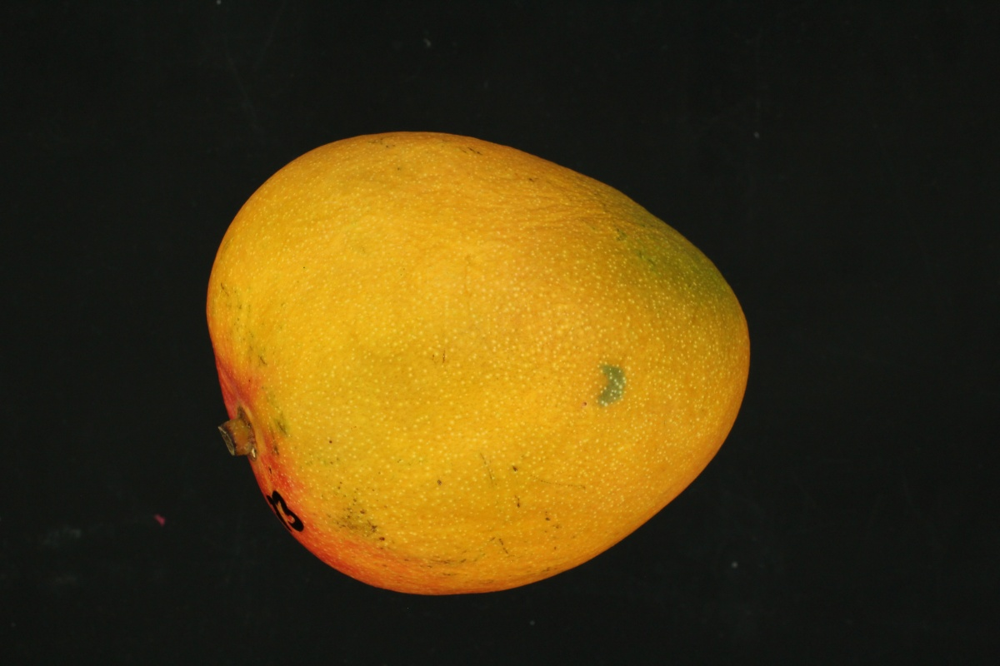  |  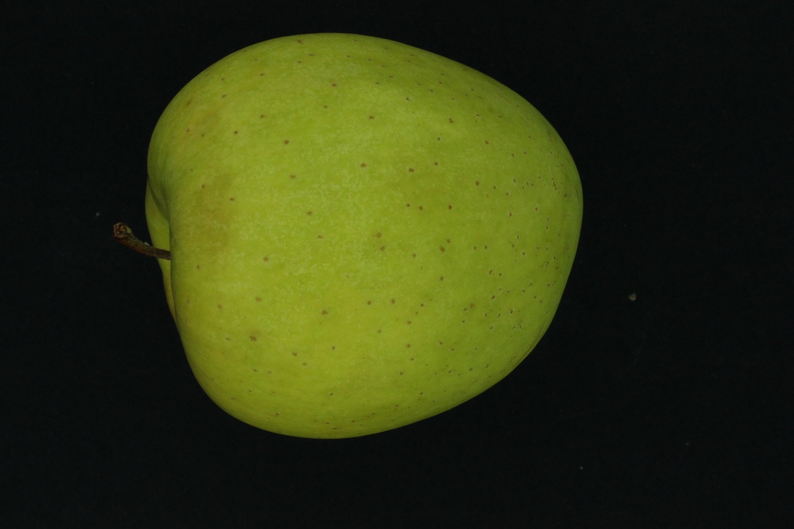

## Image segmentation processing  

Process            |[Mango](https://github.com/Minh-CaoLeCong/Fruit_Quality_Evaluation1/tree/master/image_result/mango)            |  [Apple golden](https://github.com/Minh-CaoLeCong/Fruit_Quality_Evaluation1/tree/master/image_result/apple_golden)
:-------------------------:|:-------------------------:|:-------------------------:
Gray  |  |  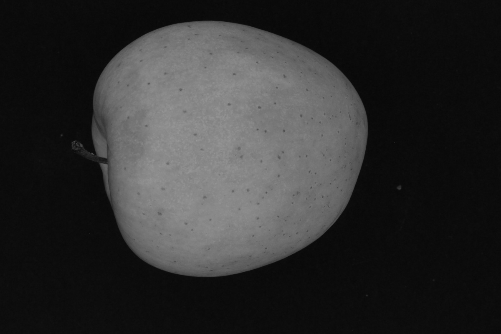
Blur  |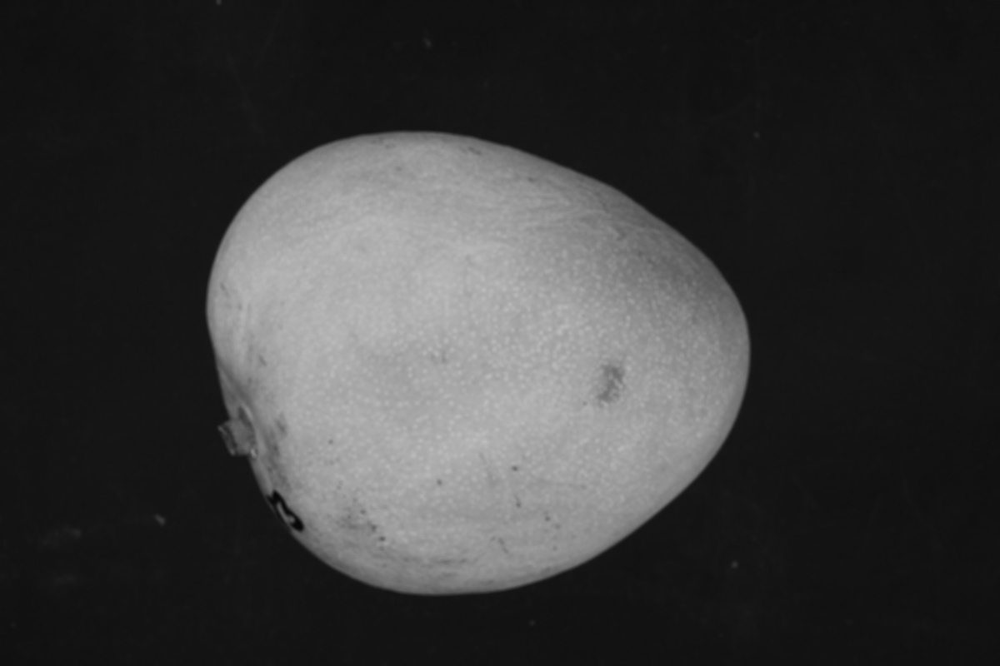  |  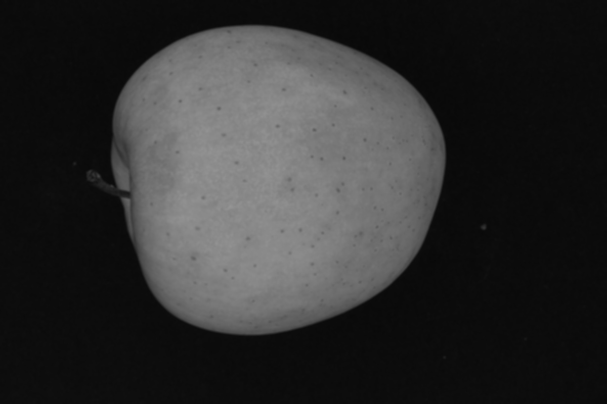
Inrange  |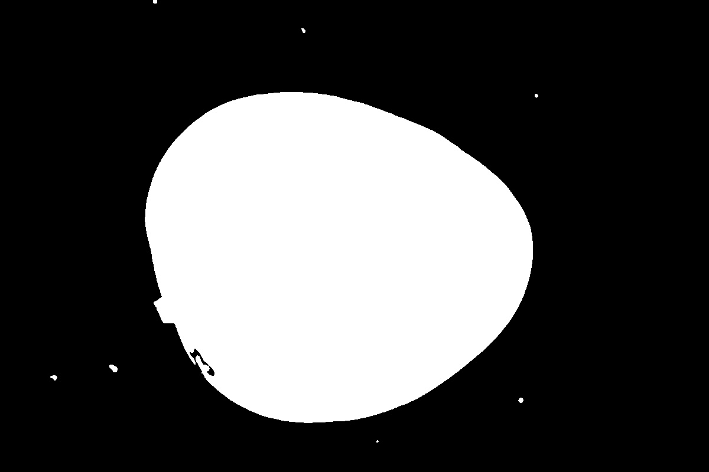  |  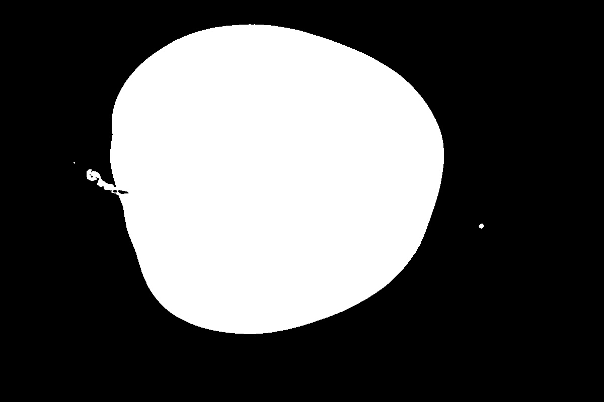
Canny  |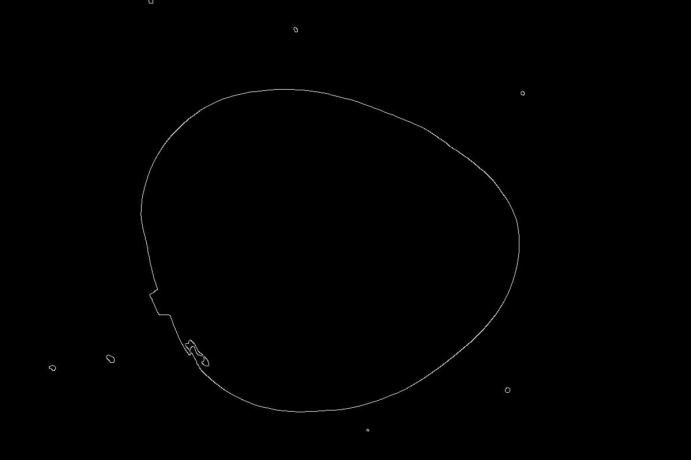  |  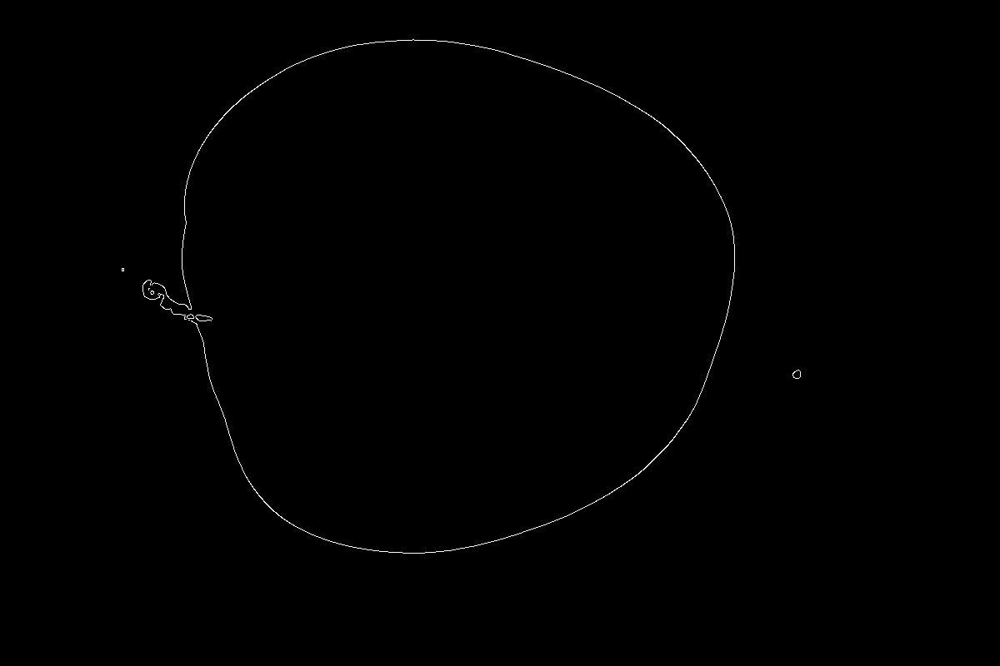
Dilate  |  |  
FloodFill  |  |  
Remove noise  |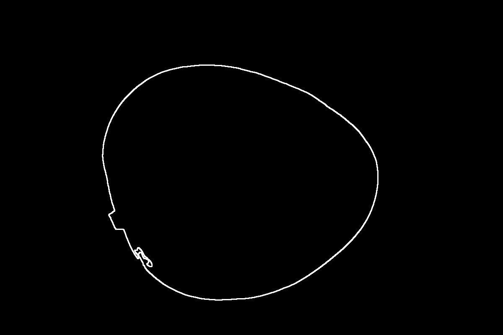  |  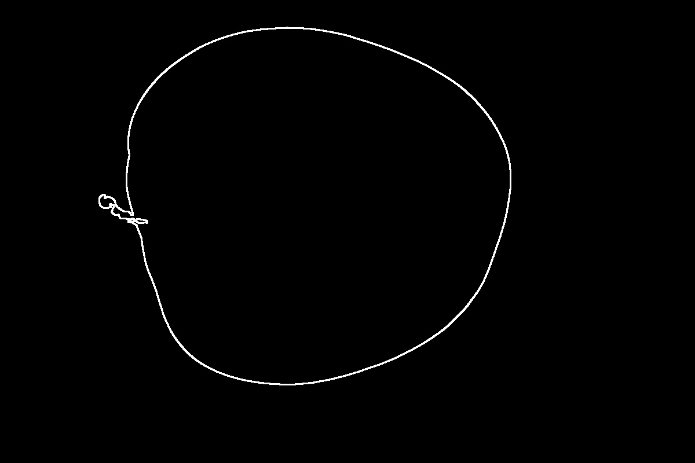
Contour  |  |  
Area  |  |  
Dimension  |  |  
Isolation  |  |  

## Feature extraction
* [Mango](https://github.com/Minh-CaoLeCong/Fruit_Quality_Evaluation1/blob/master/image_result/mango/mango1.xlsx)  

File name | Area measured by image analysis (number of pixels) | Width measured by image analysis | Height measured by image analysis | Mass measured by weighting (g) | NOTE
:-------------------------:|:-------------------------:|:-------------------------:|:-------------------------:|:-------------------------:|:-------------------------:
Mango_25_B.JPG |    296397 |    657 | 591 | 463.54 |    Immaturity
Mango_26_B.JPG |    277712 |    665 | 545 | 401.21 |    Immaturity
Mango_27_B.JPG |    287156 |    643 | 586 | 437.34 |    Immaturity
Mango_28_B.JPG |	325324 |	703 | 613 |	532.63 |    Immaturity 
Mango_29_B.JPG |	285720 |	659 | 566 |	437.36 |    Immaturity 
Mango_30_B.JPG |	285922 |	674 | 548 |	417.73 |	Immaturity 
Mango_31_B.JPG |	303157 |	655 | 612 |	494.06 |	Immaturity 
Mango_32_B.JPG |	314016 |	678	| 608 |	513.60 |	Immaturity 
Mango_33_B.JPG |	304348 |	707	| 575 |	477.24 |	Immaturity 
Mango_34_B.JPG |	321335 |	709	| 607 |	508.97 |	Immaturity 
Mango_35_B.JPG |	301064 |	704	| 580 |	464.89 |	Immaturity 
Mango_36_B.JPG |	293339 |	710	| 545 |	427.72 |	Immaturity 
Mango_37_B.JPG |	381422 |	775	| 634 |	640.44 |	Immaturity 
Mango_38_B.JPG |	309734 |	709	| 576 |	492.18 |	Immaturity 
Mango_39_B.JPG |	411628 |	834	| 654 |	739.40 |	Immaturity 
Mango_40_B.JPG |	420399 |	845	| 661 |	757.72 |	Immaturity 
Mango_41_B.JPG |	375253 |	773	| 629 |	658.54 |	Immaturity 
Mango_42_B.JPG |	360528 |	748	| 603 |	620.49 |	Immaturity 
Mango_43_B.JPG |	345198 |	728	| 645 |	592.82 |	Immaturity 
Mango_44_B.JPG |	335209 |	718	| 612 |	557.35 |	Immaturity 
Mango_45_B.JPG |	312361 |	752	| 544 |	484.43 |	Immaturity 
Mango_46_B.JPG |	401422 |	800	| 649 |	663.17 |	Immaturity 
Mango_47_B.JPG |	352250 |	734	| 614 |	600.40 |	Immaturity 
Mango_48_B.JPG |	273928 |	664	| 553 |	505.75 |	Immaturity 
Mango_49_B.JPG |	348721 |	746	| 615 |	458.05 |	Immaturity 
Mango_50_B.JPG |	310015 |	677	| 585 |	541.46 |	Immaturity 

* [Apple golden](https://github.com/Minh-CaoLeCong/Fruit_Quality_Evaluation1/blob/master/image_result/apple_golden/apple_golden.xlsx)  

File name | Area measured by image analysis (number of pixels) | Width measured by image analysis | Height measured by image analysis | Mass measured by weighting (g)
:-------------------------:|:-------------------------:|:-------------------------:|:-------------------------:|:-------------------------:
Golden_01_3.JPG | 325456	| 713	| 620	| 223.61
Golden_02_3.JPG	| 292818	| 605	| 587	| 212.49
Golden_03_3.JPG	| 308248	| 691	| 573	| 216.70
Golden_04_3.JPG	| 330242	| 639	| 644	| 237.87
Golden_05_3.JPG	| 258536	| 606	| 551	| 170.47
Golden_06_3.JPG	| 324243	| 654	| 610	| 224.15
Golden_07_3.JPG	| 281514	| 616	| 581	| 197.17
Golden_08_3.JPG	| 292763	| 651	| 608	| 206.68
Golden_09_3.JPG	| 310381	| 659	| 624	| 215.81
Golden_10_3.JPG	| 262452	| 590	| 543	| 180.21
Golden_11_3.JPG	| 310246	| 652	| 594	| 228.82
Golden_12_3.JPG	| 295091	| 612	| 617	| 208.29
Golden_13_3.JPG	| 294691	| 687	| 599	| 208.82
Golden_14_3.JPG	| 318046	| 647	| 617	| 212.37
Golden_15_3.JPG	| 340940	| 693	| 633	| 236.41
Golden_16_3.JPG	| 317143	| 663	| 584	| 219.46
Golden_17_3.JPG	| 275108	| 590	| 587	| 189.83
Golden_18_3.JPG	| 328042	| 700	| 600	| 226.72
Golden_19_3.JPG	| 329161	| 672	| 623	| 236.05
Golden_20_3.JPG	| 333618	| 688	| 589	| 229.25
Golden_21_3.JPG	| 315626	| 645	| 609	| 219.08
Golden_22_3.JPG	| 279182	| 616	| 563	| 193.42
Golden_23_3.JPG	| 319838	| 644	| 607	| 227.74
Golden_24_3.JPG	| 336852	| 712	| 638	| 241.11
Golden_25_3.JPG	| 318909	| 621	| 636	| 230.26

## Regression analysis for estimation of the weight
* Mango  

Parameters | Value
:-------------------------:|:-------------------------:
Coefficient | 0.002
Intercept   | 215.755
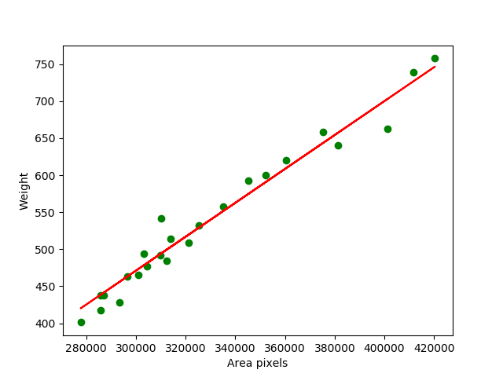  

Score | Value
:-------------------------:|:-------------------------:
Training    | 0.97
Test        | 0.96

* Apple golden  

Parameters | Value
:-------------------------:|:-------------------------:
Coefficient | 0.0008
Intercept   | 16.0667
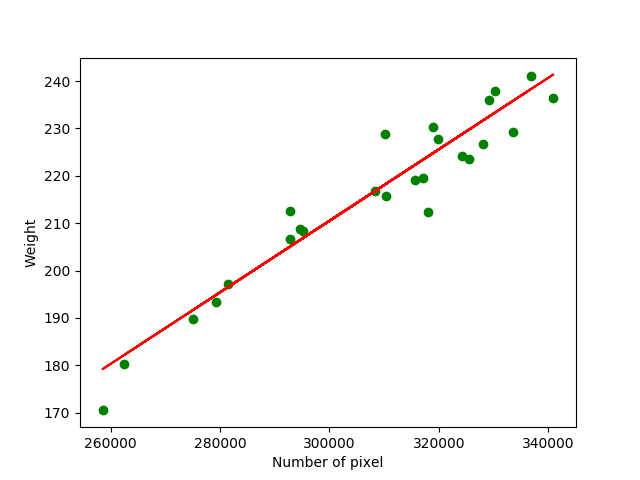  

Score | Value
:-------------------------:|:-------------------------:
Training    | 0.91
Test        | 0.92

## Contact
Cao Le Cong Minh - caolecongminh1997@gmail.com
